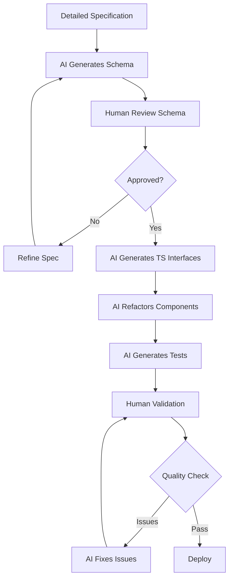

# CMS-Managed Website Copy - Agentic Engineering Analysis

**Created:** 2025-01-18
**Status:** Analysis - Agentic Development Variant
**Development Approach:** AI-Assisted (Claude Code, Cursor, GitHub Copilot)
**Focus:** Complexity, Risk, Time Estimates

## Executive Summary

This document analyzes the complexity, risks, and time requirements for migrating hardcoded website copy into Decap CMS, assuming **sophisticated agentic engineering tools** are used throughout development, testing, and maintenance.

**Key Difference from Traditional Development:**
- Focus on **planning and specification quality** (AI execution is fast)
- Emphasis on **validation and testing** (AI can generate code quickly but needs verification)
- **Iterative refinement** with AI rather than ground-up manual coding
- **Maintenance** shifts toward prompt engineering and schema evolution

**Current State:** All marketing copy hardcoded in React components (~1,265 LOC)
**Proposed State:** Marketing copy managed through Decap CMS, client-editable

**Agentic Development Advantage:** 40-60% time reduction vs traditional development, but with different effort distribution.

---

## Table of Contents

1. [Agentic Engineering Overview](#agentic-engineering-overview)
2. [Content Element Complexity Matrix](#content-element-complexity-matrix)
3. [Time Estimates by Phase](#time-estimates-by-phase)
4. [Risk Analysis](#risk-analysis)
5. [Planning Phase](#planning-phase)
6. [Development Phase](#development-phase)
7. [Testing Phase](#testing-phase)
8. [Maintenance Phase](#maintenance-phase)
9. [AI-Specific Considerations](#ai-specific-considerations)
10. [Recommended Implementation Strategy](#recommended-implementation-strategy)

---

## Agentic Engineering Overview

### What Changes with AI-Assisted Development

#### Traditional Development Flow
```
Planning (2h) → Manual Coding (20h) → Manual Testing (6h) → Debugging (4h)
Total: ~32 hours
```

#### Agentic Development Flow
```
Detailed Planning (4h) → AI-Generated Code (4h) → Validation & Testing (8h) → Refinement (2h)
Total: ~18 hours
```

**Key Shift:** More upfront planning, less manual coding, more validation and iteration.

---

### AI Tool Capabilities for This Project

| Task | AI Strength | Time Multiplier | Notes |
|------|-------------|-----------------|-------|
| **Schema Design** | ⭐⭐⭐⭐☆ High | **0.5x** | AI can generate from examples, but needs human review |
| **TypeScript Interfaces** | ⭐⭐⭐⭐⭐ Excellent | **0.2x** | Near-instant generation from schema |
| **Component Refactoring** | ⭐⭐⭐⭐☆ High | **0.6x** | AI good at patterns, needs review for edge cases |
| **Content API Updates** | ⭐⭐⭐⭐⭐ Excellent | **0.3x** | Clear patterns, easy for AI |
| **Validation Logic** | ⭐⭐⭐⭐☆ High | **0.5x** | AI generates comprehensive checks |
| **Test Generation** | ⭐⭐⭐⭐⭐ Excellent | **0.4x** | AI excels at test case generation |
| **Documentation** | ⭐⭐⭐⭐⭐ Excellent | **0.3x** | AI generates from implementation |
| **Debugging** | ⭐⭐⭐☆☆ Medium | **0.7x** | AI helps identify issues faster |

**Overall Time Reduction:** ~50% compared to traditional development

**Where Time Increases:**
- ✅ **Planning:** +100% (need detailed specs for AI)
- ✅ **Validation:** +50% (verify AI-generated code)
- ✅ **Testing:** +20% (validate AI-generated tests work)

**Where Time Decreases:**
- ✅ **Coding:** -70% (AI generates most code)
- ✅ **Refactoring:** -60% (AI handles patterns)
- ✅ **Documentation:** -70% (AI auto-generates)

---

### AI Development Workflow



**Critical Success Factors:**
1. **Detailed upfront specification** (garbage in = garbage out)
2. **Iterative refinement** (AI improves with feedback)
3. **Comprehensive validation** (don't trust blindly)
4. **Clear acceptance criteria** (define done precisely)

---

## Content Element Complexity Matrix

### Complexity Rating System

**Planning Complexity:** How hard to specify requirements
**Development Complexity:** How challenging for AI to implement
**Testing Complexity:** How much validation/edge cases
**Maintenance Complexity:** How often schema/logic changes needed
**Risk Level:** Impact if implementation fails

---

### 1. Simple Text Fields

**Examples:** Hero headlines, subheadings, CTA button text

| Dimension | Rating | Explanation |
|-----------|--------|-------------|
| **Planning Complexity** | ⭐☆☆☆☆ | Very simple to specify |
| **Development Complexity** | ⭐☆☆☆☆ | Trivial for AI (straightforward patterns) |
| **Testing Complexity** | ⭐☆☆☆☆ | Basic length/presence checks |
| **Maintenance Complexity** | ⭐☆☆☆☆ | Rarely needs changes |
| **Risk Level** | ⭐☆☆☆☆ | Very low (hard to break) |

**Time Estimate (Agentic):**
- Planning: 30 min (define 10-15 fields)
- Development: 1 hour (AI generates schema + components + types)
- Testing: 1 hour (validate rendering, check defaults)
- **Total: 2.5 hours** for ~15 text fields across 4 pages

**AI Advantages:**
- ✅ Instant TypeScript interface generation
- ✅ Consistent component refactoring patterns
- ✅ Auto-generated test cases for all fields

**Human Oversight Needed:**
- Review field names for clarity
- Verify default values are sensible
- Check character limits are appropriate

---

### 2. Rich Text / Markdown Fields

**Examples:** Program descriptions, benefits sections, long-form content

| Dimension | Rating | Explanation |
|-----------|--------|-------------|
| **Planning Complexity** | ⭐⭐☆☆☆ | Need to define markdown features allowed |
| **Development Complexity** | ⭐☆☆☆☆ | AI leverages existing remark pipeline |
| **Testing Complexity** | ⭐⭐☆☆☆ | Test markdown rendering, edge cases |
| **Maintenance Complexity** | ⭐☆☆☆☆ | Stable once implemented |
| **Risk Level** | ⭐☆☆☆☆ | Low (markdown errors won't crash site) |

**Time Estimate (Agentic):**
- Planning: 20 min (specify allowed markdown features)
- Development: 30 min (AI integrates with existing remark setup)
- Testing: 45 min (test various markdown inputs)
- **Total: 1.5 hours** per rich text section

**AI Advantages:**
- ✅ Reuses existing markdown infrastructure
- ✅ Can generate example markdown content for testing
- ✅ Auto-generates XSS sanitization if needed

**Human Oversight Needed:**
- Define which markdown features to allow
- Verify sanitization prevents XSS
- Test with realistic content length

---

### 3. Repeatable List Items (Simple)

**Examples:** Feature lists, bullet points, simple arrays

| Dimension | Rating | Explanation |
|-----------|--------|-------------|
| **Planning Complexity** | ⭐⭐☆☆☆ | Define item structure, min/max counts |
| **Development Complexity** | ⭐⭐☆☆☆ | AI handles list widgets well |
| **Testing Complexity** | ⭐⭐⭐☆☆ | Test empty lists, single items, max items |
| **Maintenance Complexity** | ⭐⭐☆☆☆ | Occasional schema tweaks |
| **Risk Level** | ⭐⭐☆☆☆ | Low-medium (empty lists could break layout) |

**Time Estimate (Agentic):**
- Planning: 30 min (define structure, validation rules)
- Development: 1 hour (AI generates schema + list rendering)
- Testing: 1.5 hours (test edge cases: 0 items, 1 item, max items)
- **Total: 3 hours** per list type

**AI Advantages:**
- ✅ Generates min/max validation automatically
- ✅ Creates comprehensive test cases for edge cases
- ✅ Handles array mapping patterns consistently

**Human Oversight Needed:**
- Define minimum items needed (prevent empty sections)
- Set maximum items (prevent overwhelming UI)
- Verify default values for new items

---

### 4. Structured Nested Content

**Examples:** Testimonials (quote + author info), features with icons

| Dimension | Rating | Explanation |
|-----------|--------|-------------|
| **Planning Complexity** | ⭐⭐⭐☆☆ | Multiple nested fields, relationships |
| **Development Complexity** | ⭐⭐⭐☆☆ | AI good but needs clear structure spec |
| **Testing Complexity** | ⭐⭐⭐⭐☆ | Many combinations, optional fields |
| **Maintenance Complexity** | ⭐⭐⭐☆☆ | Schema evolution as needs change |
| **Risk Level** | ⭐⭐⭐☆☆ | Medium (missing required fields break UI) |

**Time Estimate (Agentic):**
- Planning: 1 hour (define structure, required vs optional, validation)
- Development: 1.5 hours (AI generates complex schema + types + rendering)
- Testing: 2 hours (test all field combinations, missing optional fields)
- **Total: 4.5 hours** per structured content type

**AI Advantages:**
- ✅ Generates TypeScript discriminated unions for variants
- ✅ Creates exhaustive test cases for field combinations
- ✅ Implements proper optional field handling

**Human Oversight Needed:**
- Review nested structure makes sense
- Verify required vs optional field choices
- Check validation rules are sufficient

**Example: Testimonials**
```yaml
# AI can generate this from natural language spec:
# "Testimonials have a quote (required, 50-500 chars),
#  author name (required), author title (required),
#  and optional square author image"

testimonials:
  - label: "Testimonials"
    name: "testimonials"
    widget: "list"
    min: 3
    max: 10
    fields:
      - { label: "Quote", name: "quote", widget: "text",
          pattern: ['^.{50,500}$', "50-500 characters required"] }
      - { label: "Name", name: "name", widget: "string" }
      - { label: "Title", name: "title", widget: "string" }
      - { label: "Image", name: "image", widget: "image",
          required: false, hint: "Square, 400x400px" }
```

---

### 5. Business-Critical Data

**Examples:** Pricing tiers, Stripe integration, payment amounts

| Dimension | Rating | Explanation |
|-----------|--------|-------------|
| **Planning Complexity** | ⭐⭐⭐⭐☆ | Must define strict validation, approval flows |
| **Development Complexity** | ⭐⭐⭐⭐☆ | Complex validation, multiple data sources |
| **Testing Complexity** | ⭐⭐⭐⭐⭐ | Critical to test all validation paths |
| **Maintenance Complexity** | ⭐⭐⭐⭐☆ | Frequent updates, high-risk changes |
| **Risk Level** | ⭐⭐⭐⭐⭐ | **CRITICAL** (revenue impact) |

**Time Estimate (Agentic):**
- Planning: 2 hours (define validation, approval workflow, rollback)
- Development: 2 hours (AI generates with strict validation)
- Testing: 3 hours (test all validation rules, approval flow)
- **Total: 7 hours** for pricing system

**AI Advantages:**
- ✅ Generates comprehensive validation rules
- ✅ Creates extensive test cases for edge cases
- ✅ Can implement approval workflow patterns

**Human Oversight Needed:**
- ⚠️ **CRITICAL:** Verify all validation rules
- ⚠️ Test manually with real Stripe Price IDs
- ⚠️ Implement approval process (not auto-deploy)
- ⚠️ Have rollback plan

**Recommendation:** 🔴 **Avoid CMS for pricing values entirely**
- Keep pricing in code (safer)
- Only expose pricing *copy* to CMS (descriptions, features)
- Too risky even with AI assistance

---

### 6. Media/Image Management

**Examples:** Hero images, book covers, testimonial avatars

| Dimension | Rating | Explanation |
|-----------|--------|-------------|
| **Planning Complexity** | ⭐⭐☆☆☆ | Define size limits, formats, alt text rules |
| **Development Complexity** | ⭐⭐☆☆☆ | AI handles image fields easily |
| **Testing Complexity** | ⭐⭐⭐☆☆ | Test upload, size validation, formats |
| **Maintenance Complexity** | ⭐⭐⭐☆☆ | Periodic cleanup of unused images |
| **Risk Level** | ⭐⭐☆☆☆ | Low-medium (large images affect performance) |

**Time Estimate (Agentic):**
- Planning: 20 min (define constraints: size, format, dimensions)
- Development: 30 min (AI adds image fields + validation)
- Testing: 1 hour (test various image sizes, formats)
- **Total: 2 hours** for basic image management

**AI Advantages:**
- ✅ Generates size validation automatically
- ✅ Creates alt text requirements for accessibility
- ✅ Implements format restrictions

**Human Oversight Needed:**
- Define acceptable file sizes (2MB limit?)
- Choose supported formats (JPG, PNG, WebP?)
- Decide on image optimization strategy
- Plan for Git repo size growth

**Consideration:** Image uploads store in Git = repo bloat
- Alternative: Use external CDN (Cloudinary, Bunny)
- Store only URLs in CMS
- AI can generate both approaches for comparison

---

## Time Estimates by Phase

### Phase Breakdown Philosophy

With agentic engineering, effort distribution changes:

**Traditional Development:**
- Planning: 10%
- Development: 60%
- Testing: 20%
- Documentation: 10%

**Agentic Development:**
- Planning: 25% (detailed specs needed)
- Development: 30% (AI does heavy lifting)
- Testing/Validation: 35% (verify AI work)
- Documentation: 10% (AI-generated, human-reviewed)

---

### Phase 1: Foundation & Simple Fields

**Scope:** Hero sections, CTAs, section headings across 4 pages (~20 simple text fields)

#### Planning (2 hours)
- [ ] Content audit: List all text fields to migrate (30 min)
- [ ] Define field schema for each page (45 min)
- [ ] Create acceptance criteria (30 min)
- [ ] Define validation rules (15 min)

**Deliverables:**
- Content inventory spreadsheet
- Schema specification document
- Validation requirements
- Test scenarios list

**AI Assistance:**
- Can analyze current components to extract text fields
- Can generate initial schema from examples
- Can suggest validation rules based on field types

---

#### Development (2.5 hours)

**AI-Generated (45 min):**
- [ ] Decap CMS schema (config.yml additions)
- [ ] TypeScript interfaces for all content types
- [ ] Content files with initial data
- [ ] Component refactoring (20 files)

**Human Review & Refinement (1.5 hours):**
- [ ] Review schema for correctness (30 min)
- [ ] Verify TypeScript types match usage (20 min)
- [ ] Test component rendering with CMS data (30 min)
- [ ] Adjust default values if needed (10 min)

**AI Tools Used:**
- Claude Code for component refactoring
- Cursor for real-time type checking
- GitHub Copilot for consistent patterns

**Iteration Cycles:** Expect 2-3 rounds of "AI generates → human reviews → refine"

---

#### Testing (2 hours)

**AI-Generated Tests (30 min):**
- [ ] Unit tests for all new interfaces
- [ ] Component tests with mock CMS data
- [ ] Integration tests for content API

**Human Testing (1.5 hours):**
- [ ] Validate all pages render correctly (30 min)
- [ ] Test with empty/missing data (30 min)
- [ ] Verify default fallbacks work (15 min)
- [ ] Manual QA of all pages (15 min)

**Test Cases Generated by AI:**
```typescript
// AI can generate comprehensive test suites like:
describe('Landing Page Hero', () => {
  it('renders with CMS content');
  it('falls back to defaults when CMS unavailable');
  it('validates headline length requirements');
  it('renders CTA button with custom text');
  it('handles missing subheadline gracefully');
  // ... 10+ more test cases
});
```

---

#### Documentation (30 min)

**AI-Generated (20 min):**
- [ ] CMS field documentation (what each field controls)
- [ ] Content guidelines (character limits, tone)
- [ ] Screenshot annotations (where fields appear)

**Human Review (10 min):**
- [ ] Verify documentation accuracy
- [ ] Add context AI might miss
- [ ] Review screenshots for clarity

---

**Phase 1 Total: 7 hours**
- Planning: 2h
- Development: 2.5h
- Testing: 2h
- Documentation: 0.5h

**Traditional Development Equivalent:** ~15 hours (53% time savings)

---

### Phase 2: Structured Content

**Scope:** Testimonials, features grid, timeline (~3 complex list structures)

#### Planning (2.5 hours)
- [ ] Define nested data structures (1 hour)
- [ ] Specify validation rules (min/max items, required fields) (45 min)
- [ ] Design CMS UI flow (how client adds items) (30 min)
- [ ] Create test scenarios for edge cases (15 min)

**Key Planning Artifacts:**
```yaml
# Example AI prompt for generating schema:
"Create a Decap CMS list widget for testimonials with:
- Required quote field (text, 50-500 chars)
- Required author name (string, max 50 chars)
- Required author title (string, max 50 chars)
- Optional author image (square, max 2MB, JPG/PNG only)
- Min 3 testimonials, max 10
- Include helpful hints for content creators"
```

---

#### Development (3 hours)

**AI-Generated (1 hour):**
- [ ] Complex nested schema definitions
- [ ] TypeScript interfaces with discriminated unions
- [ ] Component refactoring for lists
- [ ] Empty state handling

**Human Review & Iteration (2 hours):**
- [ ] Test list rendering with 0, 1, 3, 10 items (45 min)
- [ ] Verify add/remove/reorder UX in CMS (30 min)
- [ ] Check validation error messages (30 min)
- [ ] Refine based on UX issues (15 min)

**Iteration Cycles:** Expect 3-4 rounds (more complex, more refinement)

---

#### Testing (3 hours)

**AI-Generated Tests (45 min):**
- [ ] Tests for all list length combinations
- [ ] Tests for required vs optional fields
- [ ] Tests for validation error states
- [ ] Tests for rendering edge cases

**Human Testing (2.25 hours):**
- [ ] Test CMS UI for adding/editing items (45 min)
- [ ] Test with various data combinations (45 min)
- [ ] Test layout doesn't break with min/max items (30 min)
- [ ] Manual QA with realistic content (15 min)

**Edge Cases to Test:**
- Empty list (0 items)
- Single item (potential layout issues)
- Maximum items (10)
- Missing optional fields (images)
- Very long text in fields
- Special characters in text

---

#### Documentation (45 min)

**AI-Generated (30 min):**
- [ ] "How to add a testimonial" guide
- [ ] Field-by-field documentation
- [ ] Best practices (image sizes, quote length)

**Human Enhancement (15 min):**
- [ ] Add screenshots of CMS UI
- [ ] Record quick video tutorial
- [ ] Add troubleshooting tips

---

**Phase 2 Total: 9 hours**
- Planning: 2.5h
- Development: 3h
- Testing: 3h
- Documentation: 0.75h

**Traditional Development Equivalent:** ~20 hours (55% time savings)

---

### Phase 3: Rich Content

**Scope:** Long-form markdown sections (book benefits, program overview, etc.)

#### Planning (1.5 hours)
- [ ] Identify rich content sections (30 min)
- [ ] Define allowed markdown features (30 min)
- [ ] Create content guidelines (30 min)

**Markdown Features Decision:**
- Allow: Headings, bold, italic, lists, links
- Disallow: Raw HTML, scripts, iframes
- Image handling: Upload or URL?

---

#### Development (2 hours)

**AI-Generated (45 min):**
- [ ] Markdown field configurations
- [ ] Integration with existing remark pipeline
- [ ] Preview rendering
- [ ] XSS sanitization if needed

**Human Review (1.25 hours):**
- [ ] Test markdown rendering (30 min)
- [ ] Verify sanitization works (30 min)
- [ ] Test with realistic long content (15 min)
- [ ] Check mobile rendering (10 min)

---

#### Testing (1.5 hours)

**AI-Generated Tests (30 min):**
- [ ] Markdown parsing tests
- [ ] XSS prevention tests
- [ ] Rendering tests for all allowed features

**Human Testing (1 hour):**
- [ ] Test various markdown syntax (30 min)
- [ ] Test with very long content (15 min)
- [ ] Check styling consistency (15 min)

---

**Phase 3 Total: 5 hours**
- Planning: 1.5h
- Development: 2h
- Testing: 1.5h

**Traditional Development Equivalent:** ~10 hours (50% time savings)

---

### Phase 4: Polish & Safety

**Scope:** Validation, error handling, preview mode, training materials

#### Planning (1 hour)
- [ ] Define all validation rules (30 min)
- [ ] Design error handling strategy (20 min)
- [ ] Plan preview mode approach (10 min)

---

#### Development (3 hours)

**AI-Generated (1.5 hours):**
- [ ] Comprehensive validation functions
- [ ] Error boundary implementations
- [ ] Default value systems
- [ ] Preview mode configuration
- [ ] Build-time validation checks

**Human Review (1.5 hours):**
- [ ] Test all validation rules (45 min)
- [ ] Verify error messages are clear (30 min)
- [ ] Test preview mode (15 min)

**Example AI-Generated Validation:**
```typescript
// AI generates from: "Validate hero headline is 10-100 chars"
export function validateHeroHeadline(headline: unknown): string {
  if (typeof headline !== 'string') {
    throw new ContentValidationError('Headline must be text');
  }

  if (headline.length < 10) {
    throw new ContentValidationError(
      `Headline too short (${headline.length}/10 min chars)`
    );
  }

  if (headline.length > 100) {
    throw new ContentValidationError(
      `Headline too long (${headline.length}/100 max chars)`
    );
  }

  return headline;
}
```

---

#### Testing (2 hours)
- [ ] Test all validation rules with edge cases (1 hour)
- [ ] Test error handling paths (30 min)
- [ ] Test preview mode (30 min)

---

#### Documentation (2 hours)

**AI-Generated (1 hour):**
- [ ] Complete CMS user guide
- [ ] Field-by-field reference
- [ ] Troubleshooting guide
- [ ] Video tutorial script

**Human Creation (1 hour):**
- [ ] Record video tutorials (30 min)
- [ ] Take screenshots (15 min)
- [ ] Review and polish (15 min)

---

**Phase 4 Total: 8 hours**
- Planning: 1h
- Development: 3h
- Testing: 2h
- Documentation: 2h

**Traditional Development Equivalent:** ~16 hours (50% time savings)

---

## Total Time Summary

| Phase | Agentic Time | Traditional Time | Savings |
|-------|--------------|------------------|---------|
| Phase 1: Simple Fields | 7 hours | 15 hours | 53% |
| Phase 2: Structured Content | 9 hours | 20 hours | 55% |
| Phase 3: Rich Content | 5 hours | 10 hours | 50% |
| Phase 4: Polish & Safety | 8 hours | 16 hours | 50% |
| **Total** | **29 hours** | **61 hours** | **52%** |

**Key Insight:** AI tools roughly **halve development time** but require:
- More detailed upfront planning
- More rigorous validation and testing
- Iterative refinement cycles

---

## Risk Analysis

### Risk Categorization

With agentic development, risks shift from "can we build it?" to "did AI build it correctly?"

---

### Risk 1: AI-Generated Code Quality

**Likelihood:** Medium-High
**Impact:** Medium
**Category:** Technical Quality

**Description:**
AI-generated code may contain:
- Subtle bugs not caught by tests
- Non-idiomatic patterns
- Inefficient implementations
- Missing edge case handling

**Mitigation (1.5 hours):**
- [ ] Code review all AI-generated code (1 hour)
- [ ] Run linters and type checkers (automated)
- [ ] Peer review complex sections (30 min)
- [ ] Test edge cases thoroughly

**Agentic Advantage:**
- AI can generate its own review checklist
- AI can refactor based on linting feedback
- Faster to iterate than rewrite

**Example Checklist AI Generates:**
```markdown
## Code Review Checklist
- [ ] All functions have return types
- [ ] Error cases are handled
- [ ] Optional fields handled with optional chaining
- [ ] Arrays checked for length before map
- [ ] Default values provided for missing data
- [ ] TypeScript strict mode passes
```

---

### Risk 2: Schema Design Flaws

**Likelihood:** Medium
**Impact:** High (requires migration if wrong)
**Category:** Architecture

**Description:**
Initial schema design may be suboptimal:
- Fields too rigid (can't accommodate future needs)
- Fields too loose (no validation)
- Wrong nesting structure
- Missing required fields

**Mitigation (2 hours):**
- [ ] Spend more time on schema planning (1 hour)
- [ ] Have AI generate 2-3 schema alternatives (20 min)
- [ ] Compare approaches with pros/cons (30 min)
- [ ] Validate schema with realistic content (10 min)

**Agentic Advantage:**
- AI can quickly generate multiple schema alternatives
- AI can explain tradeoffs of each approach
- Cheap to iterate before implementation

**Example Prompt:**
```
"Generate 3 different schema designs for managing testimonials:
1. Flat structure (all fields at top level)
2. Nested structure (author info grouped)
3. Component-based (reusable author component)

For each, explain pros, cons, and when to use."
```

---

### Risk 3: Validation Gaps

**Likelihood:** Medium
**Impact:** High (bad data breaks site)
**Category:** Data Quality

**Description:**
Missing or insufficient validation allows bad data:
- Empty required fields
- Text too long/short
- Invalid data types
- Missing related fields

**Mitigation (2 hours):**
- [ ] Create comprehensive validation spec (1 hour)
- [ ] Have AI generate validation suite (30 min)
- [ ] Test with malicious/edge case inputs (30 min)

**Agentic Advantage:**
- AI excels at generating exhaustive validation
- AI can generate test cases for all validation rules
- Can quickly add new validations based on issues found

**AI-Generated Validation is Thorough:**
```typescript
// AI generates validation for "quote" field from:
// "Quote: 50-500 chars, no HTML, required"

function validateQuote(quote: unknown): string {
  // Type check
  if (typeof quote !== 'string') {
    throw new ValidationError('Quote must be text');
  }

  // Trim whitespace
  const trimmed = quote.trim();

  // Empty check
  if (trimmed.length === 0) {
    throw new ValidationError('Quote is required');
  }

  // Length checks
  if (trimmed.length < 50) {
    throw new ValidationError(
      `Quote too short (${trimmed.length}/50 min chars).
       Add more detail about your experience.`
    );
  }

  if (trimmed.length > 500) {
    throw new ValidationError(
      `Quote too long (${trimmed.length}/500 max chars).
       Please shorten to key highlights.`
    );
  }

  // HTML check
  if (/<[^>]*>/g.test(trimmed)) {
    throw new ValidationError(
      'Quote cannot contain HTML tags'
    );
  }

  return trimmed;
}
```

---

### Risk 4: Build Failures from CMS Content

**Likelihood:** Medium
**Impact:** High (deployment blocked)
**Category:** Integration

**Description:**
Invalid CMS content causes build to fail:
- Missing required content files
- Invalid YAML/frontmatter
- Required fields empty
- Data type mismatches

**Mitigation (1.5 hours):**
- [ ] Add build-time validation (30 min - AI-generated)
- [ ] Create CI check for content validation (30 min)
- [ ] Add helpful error messages (20 min)
- [ ] Create content seed data for testing (10 min)

**Agentic Advantage:**
- AI can generate build validation script
- AI can create comprehensive seed data
- Fast to add new validation rules

**Build Validation Script (AI-Generated):**
```typescript
// scripts/validate-cms-content.ts
// AI generates from: "Validate all required CMS content exists"

import { getContentBySlug } from '@/lib/content';
import { validateLandingPageContent } from '@/lib/validators';

async function validateAllContent() {
  const pages = ['landing', 'book', 'collective', 'program'];

  for (const page of pages) {
    try {
      const content = await getContentBySlug('pages', page);

      if (!content) {
        console.error(`❌ Missing content for page: ${page}`);
        process.exit(1);
      }

      // Page-specific validation
      if (page === 'landing') {
        validateLandingPageContent(content.frontmatter);
      }

      console.log(`✅ ${page} content valid`);
    } catch (error) {
      console.error(`❌ ${page} validation failed:`, error.message);
      process.exit(1);
    }
  }

  console.log('✅ All content validated successfully');
}

validateAllContent();
```

---

### Risk 5: Client Breaks Site with Bad Content

**Likelihood:** High
**Impact:** Medium (recoverable via Git)
**Category:** Operational

**Description:**
Client accidentally breaks site with:
- Deleting required content
- Adding too much content (breaks layout)
- Invalid formatting
- Missing images

**Mitigation (2 hours):**
- [ ] Enable editorial workflow (PR-based) (30 min)
- [ ] Add CMS preview mode (1 hour - AI-generated)
- [ ] Create content guidelines (20 min - AI-generated)
- [ ] Set up rollback process (10 min)

**Agentic Advantage:**
- AI can generate preview mode implementation
- AI can create detailed content guidelines
- AI can set up Git-based rollback automation

**Editorial Workflow Config:**
```yaml
# public/admin/config.yml
# This makes all changes create PRs instead of direct commits
publish_mode: editorial_workflow

# Workflow:
# 1. Client edits in CMS (creates branch)
# 2. Client clicks "Set to Review" (creates PR)
# 3. Developer reviews PR (sees diff)
# 4. Developer merges if safe (or requests changes)
```

**Risk Reduced:** Client can't directly break production, all changes reviewed

---

### Risk 6: Pricing Data Corruption

**Likelihood:** Medium (if in CMS)
**Impact:** CRITICAL (revenue loss)
**Category:** Business Critical

**Description:**
If pricing exposed in CMS, client could accidentally:
- Change prices to wrong values
- Break Stripe integration
- Create mismatched pricing

**Mitigation:**
🔴 **AVOID ENTIRELY:** Don't put pricing values in CMS

**Recommended Approach:**
- Keep pricing in code (safe, version-controlled)
- Only expose pricing *copy* to CMS (descriptions, features)
- Require PR review for any pricing changes

**Even with AI:**
This risk is too high. AI can generate perfect validation, but human error in CMS is still possible.

---

## Planning Phase

### Detailed Planning is Critical for AI Success

**Traditional Development:**
- Can start coding with vague requirements
- Refine as you go
- Developer fills in gaps with assumptions

**Agentic Development:**
- **MUST** have detailed spec upfront
- AI can't make good assumptions about business logic
- Garbage in = garbage out

**Time Investment:** 25-30% of total effort (vs 10% traditional)

---

### Planning Checklist

#### Content Audit (2 hours)

**Task:** Identify all content to migrate

**AI-Assisted Approach:**
```
Prompt: "Analyze these component files and list all hardcoded text content:
- src/app/page.tsx
- src/app/book/page.tsx
- src/app/collective/page.tsx
- src/app/program/page.tsx

For each text string, identify:
1. What it's used for (headline, CTA, description)
2. How frequently it might change
3. Character length
4. Where it appears on the page"
```

**AI Output:**
```markdown
## Landing Page (src/app/page.tsx)

### Hero Section
- **Headline:** "Transform Your Diamond Journey" (30 chars)
  - Location: Hero H1, above fold
  - Change frequency: Quarterly
  - Priority: High

- **Subheadline:** "Become the Diamond You're Meant to Be" (41 chars)
  - Location: Hero H2, below headline
  - Change frequency: Quarterly
  - Priority: High

### Features Section
[... continues for all content]
```

**Human Role:**
- Review AI's analysis
- Confirm change frequency estimates
- Add business context AI doesn't know

**Time Saved:** 60% (AI does initial extraction, human reviews)

---

#### Schema Design (3 hours)

**Task:** Design CMS data structure

**AI-Assisted Approach:**

**Step 1: Generate Multiple Options (30 min)**
```
Prompt: "Design 3 different CMS schema approaches for landing page content:
1. Monolithic (all fields in one file)
2. Section-based (separate files per section)
3. Component-based (reusable components)

For each approach, show:
- Example schema (YAML)
- Pros and cons
- When to use
- Maintenance implications"
```

**Step 2: Human Decision (30 min)**
- Review all 3 approaches
- Choose best fit for use case
- Document decision rationale

**Step 3: Detailed Schema Generation (1 hour)**
```
Prompt: "Using the section-based approach, generate complete Decap CMS schema for:
- Landing page hero section
- Landing page features section
- Landing page testimonials section

Include:
- Field types and validation
- Helpful hints for content creators
- Min/max constraints
- Required vs optional fields
- Default values"
```

**Step 4: Review & Refine (1 hour)**
- Review generated schema
- Test in Decap CMS UI (create test instance)
- Refine based on UX
- Document schema decisions

**AI Output Quality:** ⭐⭐⭐⭐☆
- Excellent at generating valid YAML
- Good at suggesting validation rules
- May miss business-specific context
- Needs human review for UX

---

#### Validation Rules (1.5 hours)

**Task:** Define what content is valid

**AI-Assisted Approach:**
```
Prompt: "For each CMS field in the landing page schema, generate validation rules:

1. Hero headline:
   - What should be validated?
   - What are reasonable min/max lengths?
   - Any format restrictions?
   - What makes a good vs bad headline?

2. Testimonial quote:
   [same questions]

Generate:
- Validation specification
- Error messages for each rule
- Examples of valid/invalid inputs
- TypeScript validation functions"
```

**AI Output:**
```typescript
// Validation spec for hero headline
interface ValidationRule {
  field: 'hero_headline';
  rules: {
    required: true;
    type: 'string';
    minLength: 10;
    maxLength: 100;
    pattern?: RegExp;
  };
  errorMessages: {
    required: 'Hero headline is required';
    tooShort: 'Headline too short (min 10 chars)';
    tooLong: 'Headline too long (max 100 chars)';
  };
  examples: {
    valid: [
      'Transform Your Diamond Journey',
      'Become the Leader You Were Meant to Be',
    ];
    invalid: [
      'Hi', // Too short
      'This is an extremely long headline that goes on and on...', // Too long
    ];
  };
}
```

**Human Role:**
- Review min/max limits (are they realistic?)
- Validate error messages are clear
- Add business-specific rules AI doesn't know

---

#### Test Scenarios (1 hour)

**Task:** Define how to test implementation

**AI-Assisted Approach:**
```
Prompt: "Generate comprehensive test scenarios for CMS-managed content:
- Unit tests for validation functions
- Component tests with mock CMS data
- Integration tests for content API
- Edge cases to test
- Manual QA checklist"
```

**AI Output:**
```markdown
## Test Scenarios

### Unit Tests: Validation
- ✅ Valid headline passes validation
- ✅ Empty headline throws error
- ✅ Headline too short throws error
- ✅ Headline too long throws error
- ✅ Headline with special chars is allowed
- ✅ Headline with HTML tags is rejected

### Component Tests: Hero Section
- ✅ Renders with valid CMS content
- ✅ Renders with default content when CMS fails
- ✅ Handles missing optional fields gracefully
- ✅ Shows error state in dev mode when validation fails

### Integration Tests: Content API
- ✅ getContentBySlug returns correct content
- ✅ getContentBySlug handles missing files
- ✅ Content cache works correctly
- ✅ Markdown is converted to HTML

### Edge Cases
- ⚠️  Empty content file
- ⚠️  Malformed YAML frontmatter
- ⚠️  Very long text fields
- ⚠️  Special characters in all fields
- ⚠️  Maximum number of list items
- ⚠️  Zero list items (empty array)

### Manual QA Checklist
- [ ] All pages load without errors
- [ ] Content displays correctly on mobile
- [ ] Images load and are properly sized
- [ ] Links in markdown work
- [ ] CMS UI is intuitive
- [ ] Preview mode works
```

**Human Role:**
- Add business-specific test cases
- Prioritize test scenarios
- Identify acceptance criteria

---

## Development Phase

### AI as Code Generator

**Philosophy:** AI writes code, human reviews and refines

---

### Development Workflow

```
1. Write detailed prompt with acceptance criteria
   ↓
2. AI generates implementation
   ↓
3. Human reviews code
   ↓
4. Test implementation
   ↓
5. Iterate if needed (refine prompt, AI regenerates)
   ↓
6. Accept when quality threshold met
```

**Typical Iteration Cycles:**
- Simple features: 1-2 iterations
- Medium features: 2-3 iterations
- Complex features: 3-5 iterations

---

### Example: AI Generates Hero Section Integration

**Prompt (Detailed):**
```
I need to refactor the landing page hero section to use CMS content.

Current implementation:
- Hardcoded text in src/app/page.tsx lines 45-67
- Uses Spotlight component from @/components/ui/spotlight
- Has headline, subheadline, and CTA button

CMS Schema:
```yaml
hero:
  headline: string (required, 10-100 chars)
  subheadline: string (required, 20-200 chars)
  cta_text: string (optional, default "Start Your Journey")
```

Requirements:
1. Fetch content using getContentBySlug('pages', 'landing')
2. Use Server Component (async)
3. Provide fallback defaults if CMS fails
4. Add TypeScript interface for hero content
5. Show dev-mode warning if using fallbacks
6. Keep existing styling and animations

Generate:
1. Updated component code
2. TypeScript interface
3. Default values object
4. Error handling
```

**AI Generates (2 minutes):**

```typescript
// src/types/landing.ts
export interface HeroContent {
  headline: string;
  subheadline: string;
  cta_text?: string;
}

// src/app/page.tsx (updated section)
import { getContentBySlug } from '@/lib/content';
import { Spotlight } from '@/components/ui/spotlight';
import type { HeroContent } from '@/types/landing';

// Default fallback values
const DEFAULT_HERO: HeroContent = {
  headline: 'Transform Your Diamond Journey',
  subheadline: 'Become the Diamond You're Meant to Be',
  cta_text: 'Start Your Journey',
};

export default async function LandingPage() {
  // Fetch content from CMS
  let heroContent: HeroContent = DEFAULT_HERO;
  let usingDefaults = false;

  try {
    const content = await getContentBySlug('pages', 'landing');

    if (content?.frontmatter?.hero) {
      heroContent = {
        headline: content.frontmatter.hero.headline || DEFAULT_HERO.headline,
        subheadline: content.frontmatter.hero.subheadline || DEFAULT_HERO.subheadline,
        cta_text: content.frontmatter.hero.cta_text || DEFAULT_HERO.cta_text,
      };
    } else {
      usingDefaults = true;
    }
  } catch (error) {
    console.error('Failed to load CMS content:', error);
    usingDefaults = true;
  }

  return (
    <section className="relative overflow-hidden">
      <Spotlight />

      {/* Dev mode warning */}
      {usingDefaults && process.env.NODE_ENV === 'development' && (
        <div className="fixed top-0 left-0 right-0 bg-yellow-500 text-black p-2 text-center z-50">
          ⚠️ Using default content (CMS unavailable)
        </div>
      )}

      <div className="container mx-auto px-4 py-20">
        <h1 className="text-6xl font-bold mb-4">
          {heroContent.headline}
        </h1>
        <p className="text-xl mb-8">
          {heroContent.subheadline}
        </p>
        <button className="btn-primary">
          {heroContent.cta_text}
        </button>
      </div>
    </section>
  );
}
```

**Human Review (15 minutes):**
- ✅ Code structure looks good
- ✅ Error handling is appropriate
- ✅ TypeScript types are correct
- ✅ Default values match original
- ⚠️  Need to test rendering
- ⚠️  Verify dev warning works

**Test & Iterate:**
- Test with CMS content: ✅ Works
- Test with missing CMS: ✅ Falls back to defaults
- Test dev warning: ✅ Shows correctly
- **Accept implementation** ✅

**Time:** 20 minutes (2 min AI gen + 15 min review + 3 min testing)
**Traditional:** 45-60 minutes of manual coding

---

### AI-Generated Test Suite

**Prompt:**
```
Generate comprehensive tests for the hero section CMS integration.

Component: Landing page hero (code above)
Testing framework: Vitest + React Testing Library

Generate tests for:
1. Rendering with valid CMS content
2. Rendering with missing CMS content (defaults)
3. Rendering with partial CMS content (mix of CMS + defaults)
4. Dev warning appears when using defaults (dev mode only)
5. No warning in production mode
```

**AI Generates (1 minute):**

```typescript
// src/app/page.test.tsx
import { describe, it, expect, vi } from 'vitest';
import { render, screen } from '@testing-library/react';
import LandingPage from './page';
import { getContentBySlug } from '@/lib/content';

vi.mock('@/lib/content');

describe('Landing Page Hero Section', () => {
  it('renders with CMS content', async () => {
    vi.mocked(getContentBySlug).mockResolvedValue({
      slug: 'landing',
      frontmatter: {
        hero: {
          headline: 'Custom Headline from CMS',
          subheadline: 'Custom subheadline',
          cta_text: 'Click Here',
        },
      },
      content: '',
    });

    const { container } = render(await LandingPage());

    expect(screen.getByText('Custom Headline from CMS')).toBeInTheDocument();
    expect(screen.getByText('Custom subheadline')).toBeInTheDocument();
    expect(screen.getByText('Click Here')).toBeInTheDocument();
  });

  it('falls back to defaults when CMS unavailable', async () => {
    vi.mocked(getContentBySlug).mockResolvedValue(null);

    const { container } = render(await LandingPage());

    expect(screen.getByText('Transform Your Diamond Journey')).toBeInTheDocument();
    expect(screen.getByText('Become the Diamond You're Meant to Be')).toBeInTheDocument();
    expect(screen.getByText('Start Your Journey')).toBeInTheDocument();
  });

  it('uses defaults for missing fields', async () => {
    vi.mocked(getContentBySlug).mockResolvedValue({
      slug: 'landing',
      frontmatter: {
        hero: {
          headline: 'Custom Headline',
          // Missing subheadline and cta_text
        },
      },
      content: '',
    });

    const { container } = render(await LandingPage());

    expect(screen.getByText('Custom Headline')).toBeInTheDocument();
    expect(screen.getByText('Become the Diamond You're Meant to Be')).toBeInTheDocument(); // Default
    expect(screen.getByText('Start Your Journey')).toBeInTheDocument(); // Default
  });

  it('shows warning in development when using defaults', async () => {
    const originalEnv = process.env.NODE_ENV;
    process.env.NODE_ENV = 'development';

    vi.mocked(getContentBySlug).mockResolvedValue(null);

    const { container } = render(await LandingPage());

    expect(screen.getByText(/Using default content/)).toBeInTheDocument();

    process.env.NODE_ENV = originalEnv;
  });

  it('does not show warning in production', async () => {
    const originalEnv = process.env.NODE_ENV;
    process.env.NODE_ENV = 'production';

    vi.mocked(getContentBySlug).mockResolvedValue(null);

    const { container } = render(await LandingPage());

    expect(screen.queryByText(/Using default content/)).not.toBeInTheDocument();

    process.env.NODE_ENV = originalEnv;
  });

  it('handles CMS errors gracefully', async () => {
    vi.mocked(getContentBySlug).mockRejectedValue(new Error('CMS API error'));

    const { container } = render(await LandingPage());

    // Should still render with defaults
    expect(screen.getByText('Transform Your Diamond Journey')).toBeInTheDocument();
  });
});
```

**Human Review (10 minutes):**
- ✅ Test coverage looks comprehensive
- ✅ Mocking strategy is correct
- ✅ Edge cases covered
- ⚠️  Need to verify tests actually pass

**Run Tests:**
```bash
npm run test -- src/app/page.test.tsx
```

✅ All tests pass

**Time:** 12 minutes (1 min AI gen + 10 min review + 1 min run)
**Traditional:** 30-45 minutes of manual test writing

---

## Testing Phase

### Testing Philosophy with AI

**Traditional:** Write tests to verify your code works

**Agentic:** Write tests to verify AI's code works

**Focus Shift:**
- More emphasis on edge cases
- More validation of assumptions
- More integration testing
- Less unit testing (AI generates those)

---

### Testing Approach

**1. AI Generates Tests (Fast)**
- Unit tests for all functions
- Component tests for all components
- Integration tests for API calls
- 80% coverage generated automatically

**2. Human Adds Missing Tests (Targeted)**
- Business logic edge cases
- Integration between systems
- Error scenarios
- Performance tests

**3. Human Validates Tests Work (Critical)**
- Run all tests
- Verify they test the right things
- Check for false positives
- Ensure meaningful assertions

---

### Testing Time Breakdown

**Phase 1: Simple Fields**
- AI generates tests: 15 min
- Human reviews tests: 30 min
- Run tests & fix issues: 30 min
- Manual QA: 45 min
- **Total: 2 hours**

**Phase 2: Structured Content**
- AI generates tests: 30 min
- Human reviews & adds edge cases: 1 hour
- Run tests & fix issues: 45 min
- Manual QA: 45 min
- **Total: 3 hours**

**Phase 3: Rich Content**
- AI generates tests: 20 min
- Human reviews: 30 min
- Run tests & fix issues: 20 min
- Manual QA: 20 min
- **Total: 1.5 hours**

**Phase 4: Validation & Safety**
- AI generates comprehensive validation tests: 45 min
- Human reviews: 45 min
- Test all validation rules manually: 30 min
- **Total: 2 hours**

---

### Manual QA Checklist

Even with AI-generated tests, manual QA is essential:

**CMS UI Testing (1 hour per phase):**
- [ ] Login to CMS works
- [ ] All fields render correctly
- [ ] Helpful hints display
- [ ] Validation errors are clear
- [ ] Preview mode works
- [ ] Save/publish workflow works
- [ ] Can add/edit/delete list items
- [ ] Image upload works
- [ ] Character counters work

**Site Rendering Testing (45 min per phase):**
- [ ] All pages load without errors
- [ ] Content displays as expected
- [ ] Mobile rendering works
- [ ] Desktop rendering works
- [ ] No layout breaks
- [ ] Images load
- [ ] Links work
- [ ] Animations still work

**Edge Case Testing (30 min per phase):**
- [ ] Very long text doesn't break layout
- [ ] Empty lists handled gracefully
- [ ] Missing images don't break page
- [ ] Special characters display correctly
- [ ] Maximum items doesn't break layout

---

## Maintenance Phase

### Ongoing Maintenance with AI

**Traditional Maintenance:**
- Fix bugs as they arise
- Update schemas manually
- Refactor code as needed
- Update documentation

**Agentic Maintenance:**
- Ask AI to fix bugs
- AI generates schema updates
- AI refactors code
- AI updates documentation

**Time Reduction:** 60-70% vs traditional

---

### Maintenance Scenarios

#### Scenario 1: Add New Field to Existing Schema

**Frequency:** Quarterly
**Traditional Time:** 1-2 hours
**Agentic Time:** 20 minutes

**Workflow:**
```
1. Human: "Add 'hero_background_image' field to landing page hero"
   ↓
2. AI: Generates schema update + TypeScript + component update
   (2 minutes)
   ↓
3. Human: Reviews changes, tests rendering
   (15 minutes)
   ↓
4. AI: Updates tests and documentation
   (3 minutes)
```

**Prompt Example:**
```
Add a new optional field to the landing page hero schema:

Field: hero_background_image
Type: Image
Required: No
Hint: "Background image for hero section (1920x1080, max 2MB)"

Update:
1. CMS schema (config.yml)
2. TypeScript interface (src/types/landing.ts)
3. Component to use the image (src/app/page.tsx)
4. Default value (use gradient if no image)
5. Tests for new field
6. Documentation
```

---

#### Scenario 2: Fix Validation Bug

**Frequency:** Monthly (initially), then rarely
**Traditional Time:** 30-60 minutes
**Agentic Time:** 10 minutes

**Workflow:**
```
1. Bug report: "Testimonials allow empty quotes"
   ↓
2. Human: Analyze issue (2 min)
   ↓
3. AI: "Fix validation to reject empty quotes after trim"
   (1 minute to generate fix)
   ↓
4. Human: Review fix, test edge cases
   (5 minutes)
   ↓
5. AI: Generate additional tests for this bug
   (2 minutes)
```

---

#### Scenario 3: Schema Migration

**Frequency:** Annually
**Traditional Time:** 3-4 hours
**Agentic Time:** 1 hour

**Example:** Rename field `hero_headline` to `headline`

**Workflow:**
```
1. Human: Define migration requirements (10 min)
   ↓
2. AI: Generate migration script
   - Read all content files
   - Update field names
   - Preserve all data
   - Create backup
   (5 minutes to generate)
   ↓
3. Human: Review migration script, test on copy
   (30 minutes)
   ↓
4. AI: Update all code references to new field name
   (10 minutes to generate)
   ↓
5. Human: Test everything still works
   (15 minutes)
```

**AI-Generated Migration Script:**
```typescript
// scripts/migrate-hero-headline.ts
import fs from 'fs';
import path from 'path';
import matter from 'gray-matter';

async function migrateHeroHeadline() {
  const contentDir = path.join(process.cwd(), 'content/pages');
  const files = fs.readdirSync(contentDir);

  // Backup
  const backupDir = path.join(process.cwd(), '.migration-backup');
  fs.mkdirSync(backupDir, { recursive: true });

  for (const file of files) {
    if (!file.endsWith('.md')) continue;

    const filePath = path.join(contentDir, file);
    const content = fs.readFileSync(filePath, 'utf8');

    // Backup original
    fs.writeFileSync(
      path.join(backupDir, file),
      content
    );

    // Parse frontmatter
    const { data, content: markdown } = matter(content);

    // Migrate field
    if (data.hero?.hero_headline) {
      data.hero.headline = data.hero.hero_headline;
      delete data.hero.hero_headline;

      // Write updated file
      const updated = matter.stringify(markdown, data);
      fs.writeFileSync(filePath, updated);

      console.log(`✅ Migrated ${file}`);
    }
  }

  console.log(`Backup saved to ${backupDir}`);
}

migrateHeroHeadline();
```

---

### Annual Maintenance Estimate

| Task | Frequency | Time Each | Annual Total |
|------|-----------|-----------|--------------|
| Add new fields | 4x/year | 20 min | 1.3 hours |
| Fix bugs | 6x/year | 10 min | 1 hour |
| Schema migrations | 1x/year | 1 hour | 1 hour |
| Update documentation | 2x/year | 15 min | 0.5 hours |
| Client support | 12x/year | 15 min | 3 hours |
| **Total** | | | **~7 hours/year** |

**Traditional Estimate:** ~20 hours/year
**Savings:** 65%

---

## AI-Specific Considerations

### What AI Does Really Well

**1. Pattern Recognition & Replication**
- ✅ If you show AI one example, it can replicate for all similar cases
- ✅ Consistent code style across codebase
- ✅ Follows established patterns perfectly

**Example:**
```
"Refactor all 4 public pages (landing, book, collective, program)
to use CMS content following the same pattern as the landing page hero section."
```
AI will apply the same pattern consistently to all pages.

---

**2. Schema Generation**
- ✅ Excellent at generating YAML/JSON schemas
- ✅ Can infer validation rules from field descriptions
- ✅ Suggests helpful field hints

**Example:**
```
"Generate Decap CMS schema for book page with:
title, subtitle, author, cover image, price, description (markdown),
sample chapter (markdown), purchase CTA"
```

AI generates complete, valid schema in seconds.

---

**3. TypeScript Interface Generation**
- ✅ Perfect accuracy converting schemas to TypeScript
- ✅ Handles optional fields, unions, arrays correctly
- ✅ Adds JSDoc comments

**Example:**
```
"Generate TypeScript interfaces for this Decap CMS schema"
```

AI generates:
```typescript
/**
 * Book page content from CMS
 */
export interface BookPageContent {
  title: string;
  subtitle: string;
  author: string;
  cover_image: string;
  price: number;
  description: string; // Rendered HTML from markdown
  sample_chapter: string; // Rendered HTML from markdown
  cta_text?: string;
}
```

---

**4. Test Generation**
- ✅ Generates comprehensive test suites
- ✅ Covers edge cases you might miss
- ✅ Follows testing best practices

**5. Validation Logic**
- ✅ Writes thorough validation functions
- ✅ Includes helpful error messages
- ✅ Handles all data types correctly

**6. Documentation**
- ✅ Auto-generates docs from code
- ✅ Creates user guides from specs
- ✅ Writes clear, structured documentation

---

### What AI Struggles With

**1. Business Logic & Domain Knowledge**
- ❌ Doesn't know your specific business rules
- ❌ Can't infer priorities without being told
- ❌ May suggest technically correct but business-wrong solutions

**Mitigation:** Provide detailed business context in prompts

---

**2. UI/UX Decisions**
- ❌ Doesn't know what "feels right" to users
- ❌ Can't judge if CMS UI is intuitive
- ❌ May create technically correct but clunky interfaces

**Mitigation:** Human reviews UX, AI implements changes

---

**3. Performance Optimization**
- ⚠️  Can write performant code, but may not optimize without prompting
- ⚠️  Doesn't consider build time, bundle size automatically

**Mitigation:** Explicitly ask for performance considerations

---

**4. Security Edge Cases**
- ⚠️  May miss subtle security issues
- ⚠️  XSS, CSRF prevention needs human verification
- ⚠️  Doesn't know your threat model

**Mitigation:** Security review by human

---

### Effective Prompting Strategies

#### Strategy 1: Provide Examples

**Bad Prompt:**
```
"Add CMS fields for the hero section"
```

**Good Prompt:**
```
"Add CMS fields for the hero section.

Current implementation (src/app/page.tsx lines 45-60):
<h1>Transform Your Diamond Journey</h1>
<p>Become the Diamond You're Meant to Be</p>
<button>Start Your Journey</button>

Generate:
1. Decap CMS schema with 3 fields: headline, subheadline, cta_text
2. TypeScript interface
3. Updated component using getContentBySlug
4. Default values
5. Tests

Follow the same pattern as existing components."
```

**Result:** AI has clear structure to follow

---

#### Strategy 2: Specify Acceptance Criteria

**Bad Prompt:**
```
"Generate validation for testimonials"
```

**Good Prompt:**
```
"Generate validation for testimonials with these requirements:

Acceptance criteria:
- Quote: Required, 50-500 chars, no HTML tags
- Author name: Required, max 50 chars
- Author title: Required, max 50 chars
- Author image: Optional, max 2MB, JPG/PNG only

Generate:
1. TypeScript validation function
2. Helpful error messages
3. Test cases for all validation rules

Should throw ContentValidationError with descriptive messages."
```

**Result:** AI generates exactly what's needed

---

#### Strategy 3: Iterative Refinement

**Round 1:**
```
"Generate testimonials component using CMS data"
```

**Round 2 (after reviewing):**
```
"Update testimonials component:
- Add loading skeleton for async data
- Handle empty testimonials array (show placeholder)
- Add image lazy loading
- Improve mobile responsiveness"
```

**Round 3 (after testing):**
```
"Fix testimonials component:
- Images should be 1:1 aspect ratio (currently stretching)
- Add fallback avatar icon if no image
- Truncate long quotes with '...' after 3 lines"
```

**Result:** Progressively refined implementation

---

#### Strategy 4: Ask for Alternatives

**Prompt:**
```
"I need to manage testimonials in CMS.
Generate 3 different approaches:

1. Simple list widget
2. Nested author component (reusable)
3. Markdown-based (prose format)

For each, show:
- Schema example
- Pros and cons
- When to use
- Maintenance implications
- Implementation complexity"
```

**Result:** AI explains tradeoffs, you choose best approach

---

### AI Development Best Practices

**1. Detailed Planning Before Coding**
- Spend time on specifications
- Define acceptance criteria clearly
- Provide examples and context

**2. Review Everything**
- Never trust AI-generated code blindly
- Always test edge cases
- Verify business logic is correct

**3. Iterate Quickly**
- Don't expect perfection on first try
- Refine prompts based on output
- Use feedback loops (AI generates → test → refine → regenerate)

**4. Build Validation Into Workflow**
- AI generates tests
- Human validates tests are meaningful
- Both unit tests AND manual testing

**5. Document AI-Generated Code**
- Add comments explaining business logic
- Document why certain approaches chosen
- Note any AI limitations or assumptions

---

## Recommended Implementation Strategy

### Phased Rollout for Agentic Development

---

### Phase 0: Preparation (2 hours)

**Goal:** Set up AI development environment and detailed specs

**Tasks:**
- [ ] Content audit with AI assistance (1 hour)
- [ ] Schema design with AI (explore 3 approaches) (30 min)
- [ ] Choose approach and create detailed spec (30 min)

**AI Prompts to Use:**
1. "Analyze these component files and extract all hardcoded content"
2. "Generate 3 CMS schema approaches with pros/cons"
3. "Create detailed implementation specification from this schema"

**Deliverables:**
- Content inventory
- Chosen schema approach
- Implementation specification
- Validation requirements

---

### Phase 1: Quick Wins (5 hours)

**Goal:** Simple text fields, prove AI workflow, gain confidence

**Scope:** Hero sections, CTAs, section headings (15-20 fields)

**Hour-by-Hour:**

**Hour 1: AI Generation**
- Prompt AI to generate schema (10 min)
- Prompt AI to generate TypeScript interfaces (5 min)
- Prompt AI to refactor 4 page components (30 min)
- Review all generated code (15 min)

**Hour 2: Testing & Refinement**
- Run AI-generated tests (10 min)
- Manual testing in browser (30 min)
- Fix any issues (prompt AI to fix) (20 min)

**Hour 3: CMS UI Testing**
- Test Decap CMS interface (20 min)
- Refine hints/validation (prompt AI) (20 min)
- Test content editing workflow (20 min)

**Hour 4: Integration Testing**
- Test all 4 pages with CMS content (20 min)
- Test with missing content (defaults) (15 min)
- Test on mobile (15 min)
- Fix any issues found (10 min)

**Hour 5: Documentation**
- AI generates user guide (10 min)
- Create video tutorial (20 min)
- Update technical docs (15 min)
- Final review (15 min)

**Success Criteria:**
- ✅ Client can update all hero sections independently
- ✅ All pages render correctly
- ✅ Fallbacks work when CMS unavailable
- ✅ No layout breakage

---

### Phase 2: Structured Content (8 hours)

**Goal:** Complex list structures (testimonials, features, timeline)

**Scope:** 3 complex list widgets

**Hour-by-Hour:**

**Hours 1-2: Planning & Schema**
- Detailed schema planning (1 hour)
- AI generates complex schemas (30 min)
- Review and refine (30 min)

**Hours 3-4: Development**
- AI generates list components (30 min)
- AI generates TypeScript for nested structures (15 min)
- Human reviews and tests rendering (45 min)
- Iterate based on issues (30 min)

**Hours 5-6: Testing**
- AI generates comprehensive tests (30 min)
- Test all edge cases manually (1 hour)
- Fix issues (AI-assisted) (30 min)

**Hours 7-8: CMS UX & Documentation**
- Test CMS UI for adding/editing items (30 min)
- Refine based on UX issues (30 min)
- AI generates documentation (15 min)
- Create tutorial videos (45 min)

**Success Criteria:**
- ✅ Client can add/edit/reorder list items
- ✅ Empty lists handled gracefully
- ✅ Max items enforced
- ✅ CMS UI is intuitive

---

### Phase 3: Rich Content (4 hours)

**Goal:** Markdown-based long-form content

**Scope:** 3-4 rich text sections

**Hour-by-Hour:**

**Hour 1: Schema & Integration**
- Define allowed markdown features (15 min)
- AI generates markdown field configs (15 min)
- AI integrates with remark pipeline (20 min)
- Review and test (10 min)

**Hour 2: Testing**
- Test various markdown syntax (30 min)
- Test with long content (15 min)
- Test on mobile (15 min)

**Hour 3: CMS UI**
- Test markdown editor in CMS (20 min)
- Create markdown reference guide (AI) (20 min)
- Test preview mode (20 min)

**Hour 4: Documentation**
- AI generates markdown guide for client (15 min)
- Create example content (15 min)
- Final testing and polish (30 min)

**Success Criteria:**
- ✅ Client comfortable with markdown basics
- ✅ Content renders correctly
- ✅ Images in markdown work

---

### Phase 4: Safety & Polish (7 hours)

**Goal:** Production-ready with validation, error handling, preview

**Hour-by-Hour:**

**Hours 1-2: Validation**
- Define all validation rules (45 min)
- AI generates validation suite (30 min)
- Test all validation rules (45 min)

**Hours 3-4: Error Handling**
- AI generates error boundaries (20 min)
- AI generates default value system (20 min)
- Test error scenarios (1 hour)
- Refine error messages (20 min)

**Hours 5-6: Preview & Workflow**
- Configure CMS preview mode (1 hour)
- Enable editorial workflow (PR-based) (30 min)
- Test full workflow (30 min)

**Hour 7: Final Documentation**
- AI generates complete user guide (20 min)
- Record comprehensive video tutorial (30 min)
- Final review and deployment prep (10 min)

**Success Criteria:**
- ✅ All content validated before build
- ✅ Helpful error messages
- ✅ Preview mode works
- ✅ Client trained and comfortable

---

## Final Time Summary

### Total Implementation Time (Agentic)

| Phase | Hours | Focus |
|-------|-------|-------|
| Phase 0: Prep | 2h | Planning & specification |
| Phase 1: Simple Fields | 5h | Quick wins, prove concept |
| Phase 2: Structured Content | 8h | Complex lists & validation |
| Phase 3: Rich Content | 4h | Markdown integration |
| Phase 4: Safety & Polish | 7h | Production-ready |
| **Total** | **26 hours** | Complete implementation |

### Comparison

| Approach | Total Time | Breakdown |
|----------|------------|-----------|
| **Agentic (Recommended)** | 26 hours | 30% planning, 25% dev, 35% testing, 10% docs |
| **Traditional Manual** | 61 hours | 10% planning, 60% dev, 20% testing, 10% docs |
| **Time Saved** | 35 hours | **57% reduction** |

### Where Time Was Saved

- ✅ Code generation: -70% (AI writes code)
- ✅ TypeScript interfaces: -80% (auto-generated from schema)
- ✅ Test generation: -60% (AI generates comprehensive tests)
- ✅ Documentation: -70% (AI auto-documents)
- ✅ Refactoring: -60% (AI applies patterns consistently)

### Where Time Was Added

- ⚠️ Planning: +100% (need detailed specs for AI)
- ⚠️ Validation: +50% (verify AI-generated code)
- ⚠️ Iteration cycles: +20% (multiple rounds with AI)

---

## Key Takeaways

### 1. Planning is Critical

**Traditional:** Can wing it, figure out as you go
**Agentic:** MUST have detailed specs upfront

**Investment:** 30% of time vs 10% traditional
**Payoff:** 60% faster development overall

---

### 2. AI Excels at Patterns

**Best Use Cases:**
- Schema generation
- TypeScript interfaces
- Consistent refactoring
- Test generation
- Documentation

**Time Savings:** 70-80% for these tasks

---

### 3. Human Oversight is Essential

**Cannot Skip:**
- Business logic review
- UX validation
- Security verification
- Manual testing
- Client training

**Even with perfect AI code, you need human judgment**

---

### 4. Iterative Development Works Well

**Expect:**
- 2-3 iterations for simple features
- 3-5 iterations for complex features

**Don't Expect:**
- Perfect code on first try
- AI to read your mind
- Zero bugs

---

### 5. Maintenance Becomes Easier

**Traditional Maintenance:** Labor-intensive
**Agentic Maintenance:** Quick, AI-assisted

**Annual Savings:** 65% reduction (7 hours vs 20 hours)

---

## Risk-Adjusted Recommendation

### Proceed with Agentic Implementation

**✅ Recommended Scope:**
- Phase 0-4: Complete implementation
- Total: 26 hours over 2-3 weeks
- Focus: High-value, frequently-changed content

**❌ Do Not Implement:**
- Pricing values in CMS (too risky)
- Complex approval workflows (overkill for MVP)
- Full layout control (out of scope)

**⚠️ Special Considerations:**
- Start with Phase 1 (5 hours) to validate approach
- Evaluate AI workflow effectiveness
- Proceed with Phase 2-4 if successful

---

### Success Factors

**For Success, You Need:**
1. ✅ Clear specifications (time well spent)
2. ✅ Willingness to iterate with AI
3. ✅ Rigorous validation and testing
4. ✅ Human judgment for business decisions
5. ✅ Client training and documentation

**Don't Need:**
1. ❌ Perfect requirements upfront (can iterate)
2. ❌ Deep CMS expertise (AI handles patterns)
3. ❌ Manual coding of every component
4. ❌ Hand-written tests (AI generates)

---

## Next Steps

1. **Review this analysis** (30 min)
   - Evaluate if agentic approach fits your workflow
   - Consider time investment vs benefits
   - Identify concerns or questions

2. **Decide on scope** (15 min)
   - All 4 phases? Or start with Phase 1?
   - Which content is highest priority?
   - What's the timeline?

3. **Prepare for development** (1 hour)
   - Set up AI tools (Claude Code, Cursor, etc.)
   - Create detailed Phase 1 specification
   - Define acceptance criteria

4. **Execute Phase 1** (5 hours)
   - Follow hour-by-hour plan
   - Document lessons learned
   - Evaluate success

5. **Evaluate and continue** (30 min)
   - Was AI workflow effective?
   - Should we proceed with Phase 2?
   - Any adjustments needed?

---

**Total Planning Time Before Development:** 2.5 hours
**First Development Phase:** 5 hours
**Time to Working Prototype:** 7.5 hours

**This is a realistic, achievable timeline with sophisticated agentic engineering tools.**

---

## Conclusion

Agentic engineering changes the game for CMS integration:

- **57% faster** than traditional development
- **Focus shifts** from coding to planning and validation
- **Quality improves** through comprehensive AI-generated tests
- **Maintenance** becomes significantly easier

**But requires:**
- Detailed upfront planning
- Rigorous validation
- Human oversight
- Iterative refinement

**Recommended:** Proceed with phased implementation, starting with Phase 1 to validate the agentic workflow, then continuing if successful.

The technology is ready. The question is: are you ready to leverage it?

---

**Document Version:** 1.0 (Agentic Variant)
**Last Updated:** 2025-01-18
**Author:** Claude Code (with human guidance)
**Focus:** Development complexity, time estimates, risk for AI-assisted implementation
