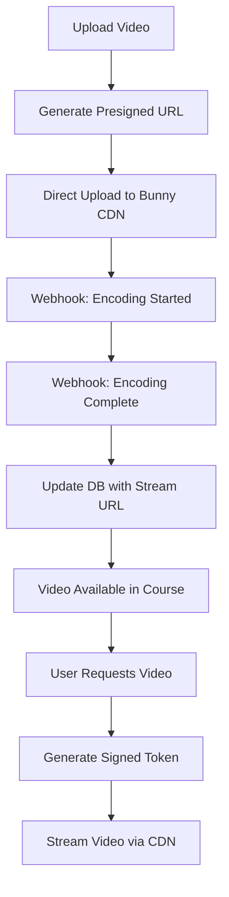

# Video Integration Implementation Plan
## Becoming Diamond - Next.js Platform

**Date**: 2025-10-05
**Status**: Planning
**Priority**: High

---

## Executive Summary

This document provides a complete implementation roadmap for integrating video hosting into the Becoming Diamond platform. Based on the comprehensive analysis in `video-hosting-analysis.md`, this plan outlines the technical implementation, timeline, and migration strategy.

### Recommended Solution: Bunny Stream

**Rationale:**
- **Cost-effective**: $10-30/month for MVP, scales predictably
- **Fast implementation**: 1-2 days to production-ready
- **Complete feature set**: DRM, adaptive streaming, analytics included
- **Developer-friendly**: Simple API, excellent documentation
- **Easy migration path**: To Mux if advanced analytics needed

---

## Table of Contents

1. [Architecture Overview](#architecture-overview)
2. [Implementation Phases](#implementation-phases)
3. [Technical Specifications](#technical-specifications)
4. [Database Schema](#database-schema)
5. [API Design](#api-design)
6. [Frontend Components](#frontend-components)
7. [Security Implementation](#security-implementation)
8. [Performance Optimization](#performance-optimization)
9. [Testing Strategy](#testing-strategy)
10. [Deployment Checklist](#deployment-checklist)
11. [Cost Projections](#cost-projections)
12. [Migration Paths](#migration-paths)

---

## Architecture Overview

### Current System
```
Next.js 15 App Router
├── Course Content (Markdown + Frontmatter)
├── Course Parser (reads markdown, generates slides)
├── Course Viewer (displays slides with placeholders)
└── Types (CourseSlide with mediaUrl/mediaType fields)
```

### Proposed System with Video
```
Next.js 15 App Router
├── Video Service Layer (abstraction)
│   ├── Bunny Stream Provider (initial)
│   └── Generic Interface (for future migrations)
├── Video Upload API Routes
│   ├── /api/video/upload (presigned URL generation)
│   ├── /api/video/[id]/status (encoding status)
│   └── /api/video/[id]/token (playback authentication)
├── Video Management UI (Admin)
│   ├── Upload interface
│   ├── Encoding progress
│   └── Video library management
├── Course Content Integration
│   ├── Enhanced parser (video metadata)
│   └── Video player component
└── Database (Video metadata)
    ├── Video records
    ├── Encoding status
    └── Access control
```

### System Flow



---

## Implementation Phases

### Phase 1: Foundation (1-2 days)

**Goals:**
- Set up Bunny Stream account
- Implement video service abstraction layer
- Create database schema
- Basic upload functionality

**Tasks:**
1. ✅ Create Bunny Stream account (https://bunny.net/stream/)
2. ✅ Install dependencies (use bun, not npm) (`@bunny.net/stream`, `@bunny.net/edgescript`)
3. ✅ Set up environment variables
4. ✅ Create `VideoService` interface and Bunny implementation
5. ✅ Create database migration for video metadata
6. ✅ Implement `/api/video/upload` endpoint
7. ✅ Test basic upload flow

**Deliverables:**
- Working upload API
- Database schema in place
- Basic video upload tested

---

### Phase 2: Player Integration (1 day)

**Goals:**
- Implement video player component
- Integrate with course viewer
- Add playback authentication

**Tasks:**
1. ✅ Create `VideoPlayer` component (using Bunny's React player or custom)
2. ✅ Implement token generation for secure playback
3. ✅ Update `SlideContent` component to render videos
4. ✅ Add loading states and error handling
5. ✅ Test playback on different devices
6. ✅ Implement analytics tracking

**Deliverables:**
- Video player component
- Course viewer with video support
- Secure playback working

---

### Phase 3: Admin UI (2-3 days)

**Goals:**
- Build video upload interface
- Create video library management
- Add encoding status monitoring

**Tasks:**
1. ✅ Create `/app/admin/videos` page (protected route)
2. ✅ Implement drag-and-drop upload UI
3. ✅ Add video metadata form (title, description, course assignment)
4. ✅ Create video library view with search/filter
5. ✅ Add encoding progress indicators
6. ✅ Implement video preview functionality
7. ✅ Add bulk operations (delete, move)

**Deliverables:**
- Admin video management interface
- Upload workflow complete
- Library management functional

---

### Phase 4: Course Integration (1 day)

**Goals:**
- Update course parser to handle video metadata
- Enhance markdown syntax for video references
- Update Decap CMS configuration

**Tasks:**
1. ✅ Extend course markdown syntax for videos
2. ✅ Update course parser to extract video references
3. ✅ Add video picker to Decap CMS
4. ✅ Create video assignment workflow
5. ✅ Test end-to-end course creation with video

**Deliverables:**
- Enhanced course parser
- CMS integration
- Complete video workflow

---

### Phase 5: Optimization & Polish (1-2 days)

**Goals:**
- Optimize playback performance
- Add analytics dashboard
- Implement caching strategies

**Tasks:**
1. ✅ Implement video preloading strategies
2. ✅ Add quality selection (if needed)
3. ✅ Create analytics dashboard for video views
4. ✅ Optimize thumbnail generation
5. ✅ Add keyboard shortcuts for video player
6. ✅ Implement video progress tracking
7. ✅ Add resume playback functionality

**Deliverables:**
- Optimized player
- Analytics dashboard
- Enhanced user experience

---

## Technical Specifications

### Dependencies

```json
{
  "dependencies": {
    "@bunny.net/stream": "^1.0.0",
    "hls.js": "^1.5.0",
    "react-player": "^2.16.0"
  },
  "devDependencies": {
    "@types/hls.js": "^1.0.0"
  }
}
```

### Environment Variables

```bash
# Bunny Stream Configuration
BUNNY_STREAM_API_KEY=your_api_key_here
BUNNY_STREAM_LIBRARY_ID=your_library_id_here
BUNNY_STREAM_CDN_HOSTNAME=your_cdn_hostname.b-cdn.net
BUNNY_STREAM_COLLECTION_ID=your_collection_id (optional for DRM)

# Video Processing
VIDEO_MAX_SIZE_MB=500
VIDEO_ALLOWED_FORMATS=mp4,mov,avi,webm
VIDEO_DEFAULT_QUALITY=1080p

# Security
VIDEO_TOKEN_SECRET=your_random_secret_key
VIDEO_TOKEN_EXPIRY_HOURS=24
```

---

## Database Schema

### Videos Table

```sql
CREATE TABLE videos (
  id TEXT PRIMARY KEY,
  bunny_video_id TEXT UNIQUE NOT NULL,
  bunny_guid TEXT UNIQUE NOT NULL,

  -- Metadata
  title TEXT NOT NULL,
  description TEXT,
  thumbnail_url TEXT,
  duration INTEGER, -- seconds

  -- File Info
  file_name TEXT,
  file_size INTEGER, -- bytes
  format TEXT,
  width INTEGER,
  height INTEGER,

  -- Status
  status TEXT CHECK(status IN ('uploading', 'processing', 'ready', 'failed')) DEFAULT 'uploading',
  encoding_progress INTEGER DEFAULT 0, -- 0-100

  -- URLs
  stream_url TEXT,
  hls_url TEXT,
  dash_url TEXT,

  -- Associations
  course_id TEXT,
  chapter_id TEXT,
  slide_id TEXT,

  -- Access Control
  is_public BOOLEAN DEFAULT FALSE,
  requires_authentication BOOLEAN DEFAULT TRUE,

  -- Analytics
  view_count INTEGER DEFAULT 0,
  total_watch_time INTEGER DEFAULT 0, -- seconds

  -- Timestamps
  uploaded_at TIMESTAMP DEFAULT CURRENT_TIMESTAMP,
  updated_at TIMESTAMP DEFAULT CURRENT_TIMESTAMP,
  published_at TIMESTAMP,

  FOREIGN KEY (course_id) REFERENCES courses(id),
  FOREIGN KEY (slide_id) REFERENCES slides(id)
);

-- Indexes
CREATE INDEX idx_videos_course ON videos(course_id);
CREATE INDEX idx_videos_slide ON videos(slide_id);
CREATE INDEX idx_videos_status ON videos(status);
CREATE INDEX idx_videos_bunny_guid ON videos(bunny_guid);
```

### Video Analytics Table

```sql
CREATE TABLE video_analytics (
  id TEXT PRIMARY KEY,
  video_id TEXT NOT NULL,
  user_id TEXT,

  -- Viewing Session
  session_id TEXT NOT NULL,
  watch_time INTEGER DEFAULT 0, -- seconds watched
  completion_percentage INTEGER DEFAULT 0,

  -- Playback Info
  quality TEXT, -- 360p, 720p, 1080p, auto
  device_type TEXT, -- mobile, tablet, desktop
  browser TEXT,

  -- Engagement
  paused_count INTEGER DEFAULT 0,
  seeked_count INTEGER DEFAULT 0,
  speed_changes INTEGER DEFAULT 0,

  -- Timestamps
  started_at TIMESTAMP DEFAULT CURRENT_TIMESTAMP,
  last_event_at TIMESTAMP,
  completed_at TIMESTAMP,

  FOREIGN KEY (video_id) REFERENCES videos(id),
  FOREIGN KEY (user_id) REFERENCES users(id)
);

-- Indexes
CREATE INDEX idx_analytics_video ON video_analytics(video_id);
CREATE INDEX idx_analytics_user ON video_analytics(user_id);
CREATE INDEX idx_analytics_session ON video_analytics(session_id);
```

---

## API Design

### Upload Endpoint

**POST `/api/video/upload`**

```typescript
// Request
interface UploadRequest {
  fileName: string;
  fileSize: number;
  title: string;
  description?: string;
  courseId?: string;
  slideId?: string;
}

// Response
interface UploadResponse {
  videoId: string;
  uploadUrl: string;
  bunnyVideoId: string;
  expiresAt: string;
}

// Implementation
export async function POST(request: Request) {
  const { fileName, fileSize, title, description, courseId, slideId } = await request.json();

  // Validate file size
  if (fileSize > MAX_FILE_SIZE) {
    return NextResponse.json({ error: 'File too large' }, { status: 400 });
  }

  // Create video in Bunny
  const bunnyResponse = await bunnyStream.createVideo({
    title,
    collectionId: process.env.BUNNY_STREAM_COLLECTION_ID,
  });

  // Generate upload URL
  const uploadUrl = await bunnyStream.getUploadUrl(bunnyResponse.guid);

  // Store in database
  const video = await db.video.create({
    data: {
      id: generateId(),
      bunny_video_id: bunnyResponse.videoId,
      bunny_guid: bunnyResponse.guid,
      title,
      description,
      file_name: fileName,
      file_size: fileSize,
      course_id: courseId,
      slide_id: slideId,
      status: 'uploading',
    },
  });

  return NextResponse.json({
    videoId: video.id,
    uploadUrl,
    bunnyVideoId: bunnyResponse.videoId,
    expiresAt: new Date(Date.now() + 3600000).toISOString(),
  });
}
```

---

### Playback Token Endpoint

**GET `/api/video/[id]/token`**

```typescript
// Response
interface TokenResponse {
  token: string;
  expiresAt: string;
  streamUrl: string;
}

// Implementation
export async function GET(
  request: Request,
  { params }: { params: { id: string } }
) {
  const session = await auth();
  if (!session) {
    return NextResponse.json({ error: 'Unauthorized' }, { status: 401 });
  }

  const video = await db.video.findUnique({
    where: { id: params.id },
  });

  if (!video) {
    return NextResponse.json({ error: 'Video not found' }, { status: 404 });
  }

  // Check access permissions
  if (video.requires_authentication && !hasAccess(session.user, video)) {
    return NextResponse.json({ error: 'Forbidden' }, { status: 403 });
  }

  // Generate signed token
  const token = await bunnyStream.generateToken(video.bunny_guid, {
    expiresIn: 86400, // 24 hours
  });

  return NextResponse.json({
    token,
    expiresAt: new Date(Date.now() + 86400000).toISOString(),
    streamUrl: video.hls_url,
  });
}
```

---

### Webhook Endpoint

**POST `/api/video/webhook`**

```typescript
// Bunny Stream sends webhooks for encoding status
export async function POST(request: Request) {
  const body = await request.json();
  const signature = request.headers.get('Bunny-Signature');

  // Verify webhook signature
  if (!verifyWebhookSignature(body, signature)) {
    return NextResponse.json({ error: 'Invalid signature' }, { status: 401 });
  }

  const { VideoGuid, Status, VideoLibraryId } = body;

  // Update video status in database
  await db.video.update({
    where: { bunny_guid: VideoGuid },
    data: {
      status: mapBunnyStatus(Status),
      encoding_progress: Status === 4 ? 100 : 50, // Bunny status codes
      updated_at: new Date(),
    },
  });

  // If encoding complete, fetch video details
  if (Status === 4) {
    const videoDetails = await bunnyStream.getVideo(VideoGuid);
    await db.video.update({
      where: { bunny_guid: VideoGuid },
      data: {
        duration: videoDetails.length,
        width: videoDetails.width,
        height: videoDetails.height,
        thumbnail_url: videoDetails.thumbnailUrl,
        hls_url: videoDetails.hlsUrl,
        stream_url: `https://${process.env.BUNNY_STREAM_CDN_HOSTNAME}/${VideoGuid}/playlist.m3u8`,
      },
    });
  }

  return NextResponse.json({ success: true });
}
```

---

## Frontend Components

### VideoPlayer Component

```typescript
'use client';

import { useEffect, useRef, useState } from 'react';
import Hls from 'hls.js';

interface VideoPlayerProps {
  videoId: string;
  autoplay?: boolean;
  onProgress?: (progress: number) => void;
  onComplete?: () => void;
}

export function VideoPlayer({
  videoId,
  autoplay = false,
  onProgress,
  onComplete,
}: VideoPlayerProps) {
  const videoRef = useRef<HTMLVideoElement>(null);
  const [loading, setLoading] = useState(true);
  const [error, setError] = useState<string | null>(null);
  const [token, setToken] = useState<string | null>(null);
  const [streamUrl, setStreamUrl] = useState<string | null>(null);

  // Fetch playback token
  useEffect(() => {
    async function fetchToken() {
      try {
        const response = await fetch(`/api/video/${videoId}/token`);
        if (!response.ok) throw new Error('Failed to get video token');

        const data = await response.json();
        setToken(data.token);
        setStreamUrl(data.streamUrl);
      } catch (err) {
        setError(err.message);
      }
    }

    fetchToken();
  }, [videoId]);

  // Initialize HLS player
  useEffect(() => {
    if (!streamUrl || !videoRef.current) return;

    const video = videoRef.current;

    if (Hls.isSupported()) {
      const hls = new Hls({
        xhrSetup: (xhr) => {
          xhr.setRequestHeader('Authorization', `Bearer ${token}`);
        },
      });

      hls.loadSource(streamUrl);
      hls.attachMedia(video);

      hls.on(Hls.Events.MANIFEST_PARSED, () => {
        setLoading(false);
        if (autoplay) {
          video.play();
        }
      });

      hls.on(Hls.Events.ERROR, (event, data) => {
        if (data.fatal) {
          setError('Video playback error');
        }
      });

      return () => {
        hls.destroy();
      };
    } else if (video.canPlayType('application/vnd.apple.mpegurl')) {
      // Native HLS support (Safari)
      video.src = streamUrl;
      video.addEventListener('loadedmetadata', () => {
        setLoading(false);
        if (autoplay) {
          video.play();
        }
      });
    } else {
      setError('HLS not supported in this browser');
    }
  }, [streamUrl, token, autoplay]);

  // Track progress
  useEffect(() => {
    if (!videoRef.current) return;

    const video = videoRef.current;

    const handleTimeUpdate = () => {
      const progress = (video.currentTime / video.duration) * 100;
      onProgress?.(progress);
    };

    const handleEnded = () => {
      onComplete?.();
    };

    video.addEventListener('timeupdate', handleTimeUpdate);
    video.addEventListener('ended', handleEnded);

    return () => {
      video.removeEventListener('timeupdate', handleTimeUpdate);
      video.removeEventListener('ended', handleEnded);
    };
  }, [onProgress, onComplete]);

  if (error) {
    return (
      <div className="bg-red-50 border border-red-200 rounded-lg p-4">
        <p className="text-red-800">Error loading video: {error}</p>
      </div>
    );
  }

  return (
    <div className="relative w-full aspect-video bg-black rounded-lg overflow-hidden">
      {loading && (
        <div className="absolute inset-0 flex items-center justify-center">
          <div className="animate-spin rounded-full h-12 w-12 border-t-2 border-b-2 border-primary"></div>
        </div>
      )}
      <video
        ref={videoRef}
        className="w-full h-full"
        controls
        playsInline
      />
    </div>
  );
}
```

---

### VideoUpload Component (Admin)

```typescript
'use client';

import { useCallback, useState } from 'react';
import { useDropzone } from 'react-dropzone';

interface VideoUploadProps {
  onUploadComplete?: (videoId: string) => void;
}

export function VideoUpload({ onUploadComplete }: VideoUploadProps) {
  const [uploading, setUploading] = useState(false);
  const [progress, setProgress] = useState(0);
  const [error, setError] = useState<string | null>(null);

  const onDrop = useCallback(async (acceptedFiles: File[]) => {
    const file = acceptedFiles[0];
    if (!file) return;

    setUploading(true);
    setError(null);
    setProgress(0);

    try {
      // Step 1: Get upload URL
      const uploadResponse = await fetch('/api/video/upload', {
        method: 'POST',
        headers: { 'Content-Type': 'application/json' },
        body: JSON.stringify({
          fileName: file.name,
          fileSize: file.size,
          title: file.name.replace(/\.[^/.]+$/, ''), // Remove extension
        }),
      });

      if (!uploadResponse.ok) {
        throw new Error('Failed to get upload URL');
      }

      const { videoId, uploadUrl } = await uploadResponse.json();

      // Step 2: Upload file directly to Bunny
      const xhr = new XMLHttpRequest();

      xhr.upload.addEventListener('progress', (e) => {
        if (e.lengthComputable) {
          const percentComplete = (e.loaded / e.total) * 100;
          setProgress(percentComplete);
        }
      });

      xhr.addEventListener('load', () => {
        if (xhr.status === 200) {
          onUploadComplete?.(videoId);
          setUploading(false);
          setProgress(100);
        } else {
          throw new Error('Upload failed');
        }
      });

      xhr.addEventListener('error', () => {
        throw new Error('Network error during upload');
      });

      xhr.open('PUT', uploadUrl);
      xhr.setRequestHeader('Content-Type', 'application/octet-stream');
      xhr.send(file);

    } catch (err) {
      setError(err.message);
      setUploading(false);
    }
  }, [onUploadComplete]);

  const { getRootProps, getInputProps, isDragActive } = useDropzone({
    onDrop,
    accept: {
      'video/*': ['.mp4', '.mov', '.avi', '.webm'],
    },
    maxFiles: 1,
    disabled: uploading,
  });

  return (
    <div className="w-full">
      <div
        {...getRootProps()}
        className={`
          border-2 border-dashed rounded-lg p-8 text-center cursor-pointer
          transition-colors duration-200
          ${isDragActive ? 'border-primary bg-primary/5' : 'border-gray-300'}
          ${uploading ? 'opacity-50 cursor-not-allowed' : 'hover:border-primary'}
        `}
      >
        <input {...getInputProps()} />

        {uploading ? (
          <div className="space-y-4">
            <p className="text-gray-600">Uploading... {progress.toFixed(0)}%</p>
            <div className="w-full bg-gray-200 rounded-full h-2">
              <div
                className="bg-primary h-2 rounded-full transition-all duration-300"
                style={{ width: `${progress}%` }}
              />
            </div>
          </div>
        ) : isDragActive ? (
          <p className="text-primary">Drop video here...</p>
        ) : (
          <div className="space-y-2">
            <p className="text-gray-600">
              Drag & drop a video file here, or click to select
            </p>
            <p className="text-sm text-gray-400">
              Supported formats: MP4, MOV, AVI, WebM
            </p>
          </div>
        )}
      </div>

      {error && (
        <div className="mt-4 bg-red-50 border border-red-200 rounded-lg p-4">
          <p className="text-red-800">{error}</p>
        </div>
      )}
    </div>
  );
}
```

---

## Security Implementation

### Token-Based Authentication (Initial MVP)

```typescript
// lib/video-auth.ts
import { SignJWT, jwtVerify } from 'jose';

const secret = new TextEncoder().encode(
  process.env.VIDEO_TOKEN_SECRET || 'fallback-secret-key-change-me'
);

export async function generateVideoToken(
  videoId: string,
  userId: string,
  options: {
    expiresIn?: number; // seconds
    ipAddress?: string;
  } = {}
) {
  const { expiresIn = 86400, ipAddress } = options;

  const token = await new SignJWT({
    videoId,
    userId,
    ip: ipAddress,
  })
    .setProtectedHeader({ alg: 'HS256' })
    .setIssuedAt()
    .setExpirationTime(`${expiresIn}s`)
    .sign(secret);

  return token;
}

export async function verifyVideoToken(token: string) {
  try {
    const { payload } = await jwtVerify(token, secret);
    return payload;
  } catch (error) {
    throw new Error('Invalid or expired token');
  }
}
```

### DRM Implementation (Future Enhancement)

If piracy becomes an issue (5%+ rate), upgrade to DRM:

```typescript
// lib/bunny-drm.ts
export async function generateDRMToken(
  videoGuid: string,
  userId: string
) {
  const response = await fetch(
    `https://video.bunnycdn.com/library/${LIBRARY_ID}/videos/${videoGuid}/play`,
    {
      method: 'POST',
      headers: {
        'AccessKey': process.env.BUNNY_STREAM_API_KEY,
        'Content-Type': 'application/json',
      },
      body: JSON.stringify({
        token: userId,
        expires: Math.floor(Date.now() / 1000) + 86400, // 24 hours
      }),
    }
  );

  return response.json();
}
```

---

## Performance Optimization

### 1. Video Preloading Strategy

```typescript
// Preload next video in course sequence
export function useVideoPreload(nextVideoId?: string) {
  useEffect(() => {
    if (!nextVideoId) return;

    const link = document.createElement('link');
    link.rel = 'prefetch';
    link.as = 'fetch';
    link.href = `/api/video/${nextVideoId}/token`;
    document.head.appendChild(link);

    return () => {
      document.head.removeChild(link);
    };
  }, [nextVideoId]);
}
```

### 2. Thumbnail Optimization

```typescript
// Generate optimized thumbnails via Bunny
export async function getOptimizedThumbnail(
  videoGuid: string,
  width: number = 480
) {
  return `https://${process.env.BUNNY_STREAM_CDN_HOSTNAME}/${videoGuid}/thumbnail.jpg?width=${width}`;
}
```

### 3. Adaptive Bitrate Streaming

Bunny Stream automatically handles adaptive bitrate. Player will select optimal quality based on:
- User's bandwidth
- Device capabilities
- Screen size

Manual quality selection (optional):

```typescript
// Add quality selector to player
const qualities = [
  { label: 'Auto', value: 'auto' },
  { label: '1080p', value: '1080' },
  { label: '720p', value: '720' },
  { label: '480p', value: '480' },
  { label: '360p', value: '360' },
];

hls.on(Hls.Events.MANIFEST_PARSED, (event, data) => {
  const availableLevels = hls.levels.map((level, index) => ({
    label: `${level.height}p`,
    value: index,
  }));
  setQualityLevels(availableLevels);
});
```

### 4. Resume Playback

```typescript
// Store progress in database
export async function saveVideoProgress(
  userId: string,
  videoId: string,
  currentTime: number
) {
  await db.videoProgress.upsert({
    where: {
      userId_videoId: { userId, videoId },
    },
    update: {
      currentTime,
      lastWatchedAt: new Date(),
    },
    create: {
      userId,
      videoId,
      currentTime,
      lastWatchedAt: new Date(),
    },
  });
}

// Resume from saved position
export async function getVideoProgress(userId: string, videoId: string) {
  return db.videoProgress.findUnique({
    where: {
      userId_videoId: { userId, videoId },
    },
  });
}
```

---

## Testing Strategy

### Unit Tests

```typescript
// __tests__/video-service.test.ts
import { describe, it, expect, vi } from 'vitest';
import { BunnyVideoService } from '@/lib/video-service';

describe('BunnyVideoService', () => {
  it('should create video and return upload URL', async () => {
    const service = new BunnyVideoService();
    const result = await service.createVideo({
      title: 'Test Video',
      fileName: 'test.mp4',
      fileSize: 1000000,
    });

    expect(result).toHaveProperty('videoId');
    expect(result).toHaveProperty('uploadUrl');
    expect(result.uploadUrl).toMatch(/^https:\/\//);
  });

  it('should generate valid playback token', async () => {
    const service = new BunnyVideoService();
    const token = await service.generatePlaybackToken('test-guid', 'user-123');

    expect(token).toBeTruthy();
    expect(typeof token).toBe('string');
  });
});
```

### Integration Tests

```typescript
// __tests__/video-upload.integration.test.ts
describe('Video Upload Flow', () => {
  it('should complete full upload workflow', async () => {
    // 1. Request upload URL
    const uploadRequest = await fetch('/api/video/upload', {
      method: 'POST',
      body: JSON.stringify({
        fileName: 'test.mp4',
        fileSize: 1000000,
        title: 'Integration Test Video',
      }),
    });
    const { videoId, uploadUrl } = await uploadRequest.json();

    // 2. Upload file
    const file = new Blob(['video content'], { type: 'video/mp4' });
    await fetch(uploadUrl, {
      method: 'PUT',
      body: file,
    });

    // 3. Wait for processing
    await waitForVideoStatus(videoId, 'ready', 30000);

    // 4. Verify video is accessible
    const tokenRequest = await fetch(`/api/video/${videoId}/token`);
    expect(tokenRequest.ok).toBe(true);
  });
});
```

### E2E Tests (Playwright)

```typescript
// e2e/video-playback.spec.ts
import { test, expect } from '@playwright/test';

test('video playback in course viewer', async ({ page }) => {
  // Navigate to course with video
  await page.goto('/app/courses/test-course/slide-1');

  // Wait for video player to load
  const videoPlayer = page.locator('video');
  await expect(videoPlayer).toBeVisible();

  // Click play
  await page.click('button[aria-label="Play"]');

  // Verify video is playing
  await page.waitForTimeout(2000);
  const isPlaying = await videoPlayer.evaluate((video: HTMLVideoElement) => {
    return !video.paused && video.currentTime > 0;
  });
  expect(isPlaying).toBe(true);
});
```

---

## Deployment Checklist

### Pre-Deployment

- [ ] Bunny Stream account created and configured
- [ ] Environment variables set in Vercel
- [ ] Database migrations run
- [ ] Webhook endpoint configured in Bunny dashboard
- [ ] Test uploads in staging environment
- [ ] Token generation tested
- [ ] Playback tested on multiple devices/browsers
- [ ] Admin UI tested

### Deployment

- [ ] Deploy to staging
- [ ] Run integration tests
- [ ] Test video upload end-to-end
- [ ] Verify webhook delivery
- [ ] Check analytics tracking
- [ ] Test on mobile devices
- [ ] Deploy to production
- [ ] Monitor error logs
- [ ] Verify first video upload in production

### Post-Deployment

- [ ] Document admin workflow
- [ ] Train content creators on upload process
- [ ] Set up monitoring alerts
- [ ] Configure backup strategy for video metadata
- [ ] Schedule first performance review (1 week)

---

## Cost Projections

### Bunny Stream Pricing

**Storage**: $0.02/GB/month
**Encoding**: Free
**Streaming**: $0.01/GB delivered

### Monthly Costs by Scenario

| Scenario | Videos | Storage | Views/mo | Bandwidth | Monthly Cost |
|----------|--------|---------|----------|-----------|--------------|
| **MVP** | 20 | 10 GB | 500 | 50 GB | $10 |
| **Small** | 100 | 50 GB | 1,000 | 100 GB | $12 |
| **Medium** | 500 | 250 GB | 10,000 | 1 TB | $60 |
| **Large** | 1,000 | 500 GB | 50,000 | 5 TB | $295 |

### Cost Optimization Strategies

1. **Video Compression**: Use H.264 with moderate quality (saves 30-50% storage)
2. **Smart Caching**: Leverage Bunny's global CDN (included, no extra cost)
3. **Progressive Upload**: Only upload videos as courses are built
4. **Archive Old Content**: Move rarely-watched videos to cold storage

### ROI Analysis

Assuming $97/course subscription:
- **Break-even**: 1 subscriber covers MVP costs for 10 months
- **Profit margin**: 99%+ after infrastructure costs
- **Scalability**: Linear cost increase with usage (predictable)

---

## Migration Paths

### Scenario 1: Bunny → Mux (If Analytics Needs Grow)

**Why Migrate:**
- Need advanced analytics and insights
- Want better quality metrics (QoS, engagement)
- Require more granular data export

**Migration Steps:**
1. Set up Mux account alongside Bunny
2. Implement Mux provider in video service abstraction
3. Gradually upload new videos to Mux
4. Migrate high-value videos first
5. Update database to support multiple CDN sources
6. Deprecate Bunny for new uploads

**Estimated Effort**: 2-3 days
**Cost Impact**: +$100-200/month

---

### Scenario 2: Self-Hosted → Bunny (If Starting DIY)

**Why Migrate:**
- Self-hosted becomes expensive/complex
- Need CDN and adaptive streaming
- Want professional encoding

**Migration Steps:**
1. Export all videos from self-hosted storage
2. Bulk upload to Bunny using their API
3. Update database video URLs
4. Test playback
5. Deprecate self-hosted infrastructure

**Estimated Effort**: 1 week
**Cost Impact**: -50% (lower bandwidth costs)

---

### Scenario 3: YouTube → Bunny (Professional Upgrade)

**Why Migrate:**
- Want branded player without YouTube branding
- Need access control and authentication
- Require better analytics
- Want faster support

**Migration Steps:**
1. Download all YouTube videos (use youtube-dl or similar)
2. Upload to Bunny
3. Update embed codes to use VideoPlayer component
4. Verify all videos transferred
5. Make YouTube videos private/unlisted as backup

**Estimated Effort**: 2-3 days
**Cost Impact**: +$10-30/month (but better UX)

---

## Next Steps

### Immediate Actions (This Week)

1. **Set up Bunny Stream account**
   - Visit https://bunny.net/stream/
   - Create library for "Becoming Diamond"
   - Note API key and library ID
   - Configure webhook endpoint URL

2. **Update Environment Variables**
   - Add Bunny credentials to `.env.local`
   - Add to Vercel environment variables
   - Test connection with simple API call

3. **Create Database Migration**
   - Add `videos` table
   - Add `video_analytics` table
   - Test migration in local environment

### This Month

1. **Implement Phase 1: Foundation**
   - Video service abstraction layer
   - Upload API endpoint
   - Basic database operations

2. **Implement Phase 2: Player Integration**
   - VideoPlayer component
   - Token authentication
   - Basic playback

3. **Implement Phase 3: Admin UI**
   - Upload interface
   - Video library
   - Encoding status

### Long-Term (3-6 Months)

1. **Analytics Dashboard**
   - View tracking
   - Completion rates
   - Engagement metrics

2. **Advanced Features**
   - Chapters/timestamps
   - Transcripts/captions
   - Interactive elements

3. **Optimization**
   - Bandwidth reduction strategies
   - Quality improvements
   - Mobile app support (if applicable)

---

## Resources

### Documentation
- **Bunny Stream Docs**: https://docs.bunny.net/docs/stream
- **Bunny API Reference**: https://docs.bunny.net/reference/video_getvideoheatmap
- **HLS.js Documentation**: https://github.com/video-dev/hls.js
- **Next.js 15 App Router**: https://nextjs.org/docs/app

### Tools
- **Video Compression**: HandBrake, FFmpeg
- **Testing**: Playwright, Vitest
- **Monitoring**: Vercel Analytics, Sentry
- **CDN Testing**: WebPageTest, GTmetrix

### Support
- **Bunny Support**: support@bunny.net
- **Community**: Discord server for Next.js
- **Video Optimization**: r/videoproduction on Reddit

---

## Conclusion

This implementation plan provides a complete roadmap for integrating video hosting into the Becoming Diamond platform using Bunny Stream. The phased approach allows for rapid MVP deployment (1-2 days) while maintaining flexibility for future enhancements.

**Key Takeaways:**
✅ Start with Bunny Stream for cost-effectiveness and simplicity
✅ Use token authentication initially (DRM only if needed later)
✅ Implement video service abstraction for easy migration
✅ Focus on user experience: fast loading, resume playback, analytics
✅ Monitor costs and usage patterns to inform scaling decisions

**Next Step**: Review this plan with stakeholders and get approval to proceed with Phase 1 implementation.
